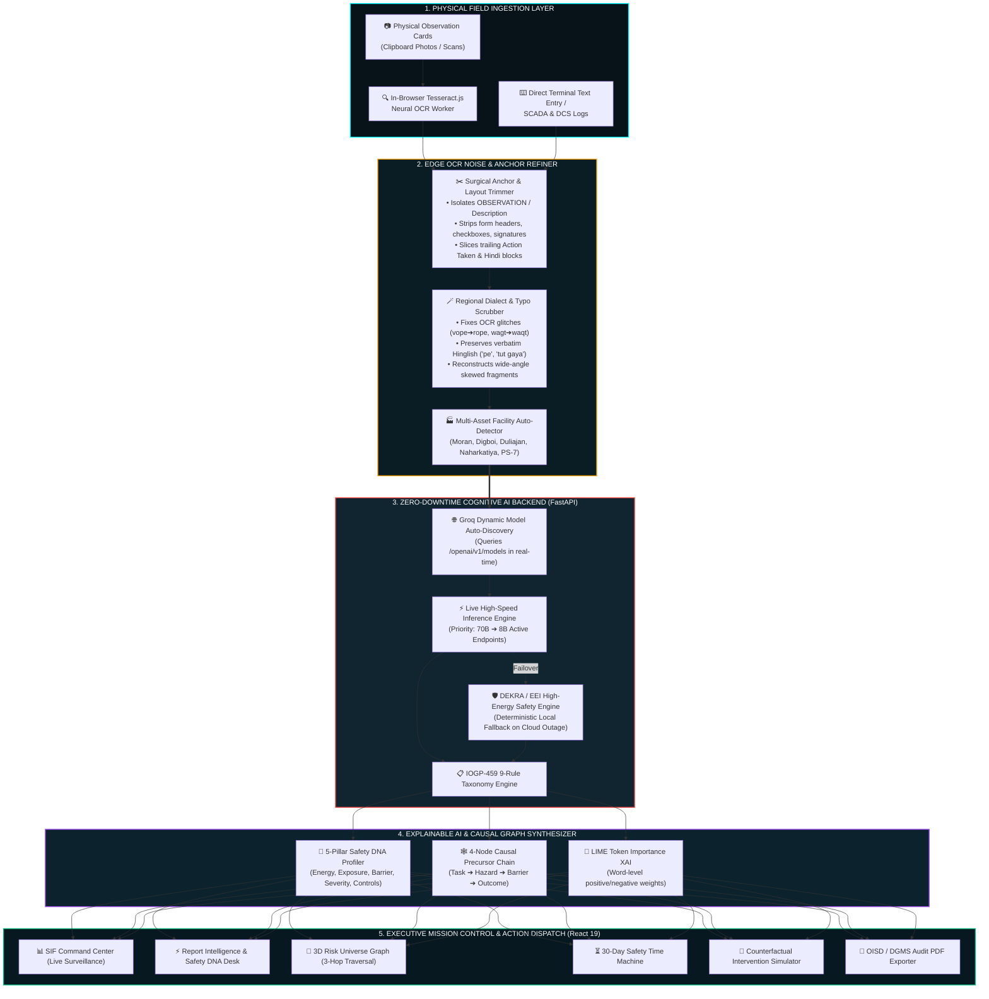
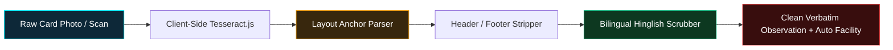
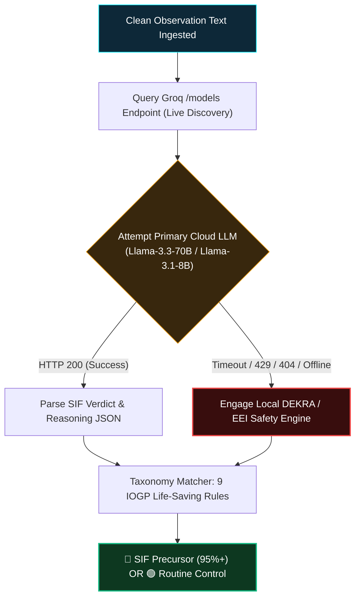
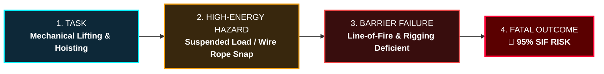
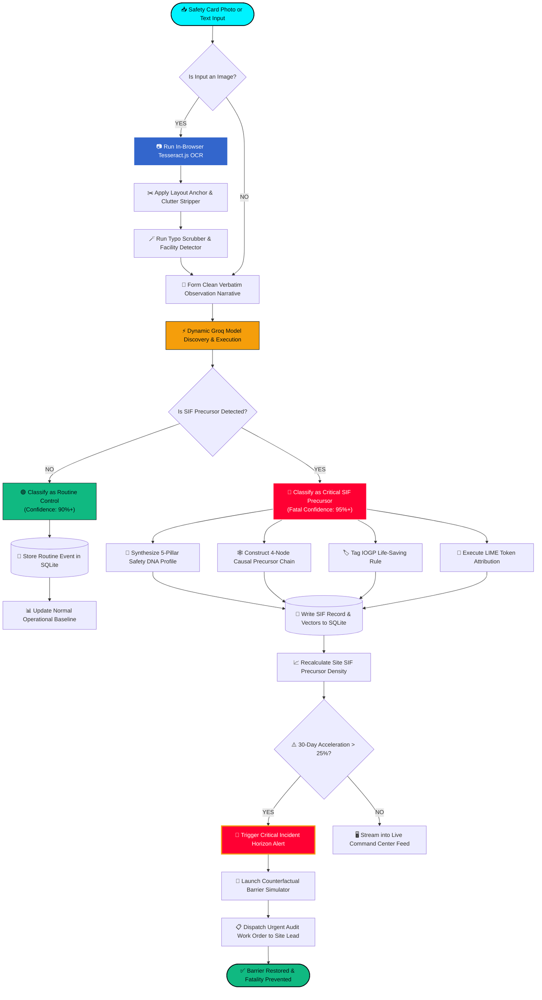

# 🛡️ SENTINEL-X — Autonomous SIF Precursor Intelligence Engine

### Smart India Hackathon 2026 • Problem Statement ID: 26165 (SIH26165)
**AI/NLP Engine to Detect Serious Injury & Fatality (SIF) Precursors in OIL's Unsafe-Act/Unsafe-Condition and Near-Miss Reports**  
*Organization: Oil India Limited (OIL) • Ministry of Petroleum & Natural Gas (MoPNG) • Theme: Smart Automation*

---

[](https://fastapi.tiangolo.com/)
[](https://react.dev/)
[](https://vitejs.dev/)
[](https://www.python.org/)
[](https://github.com/naptha/tesseract.js)
[](https://www.iogp.org/life-savingrules/)
[-FF9933.svg?style=flat)](https://www.oisd.gov.in/)
[](https://github.com/marcotcr/lime)
[](./LICENSE)

---

> **“Traditional industrial safety systems passively categorize accidents after they happen. SENTINEL-X deconstructs raw, unstructured field observations into high-energy causal chains, tracks temporal precursor momentum, and simulates counterfactual interventions to stop fatalities before energy is released.”**

---

## 📑 Table of Contents

- [Official SIH Problem Statement Details (PS ID: 26165)](#-official-sih-problem-statement-details-ps-id-26165)
- [Executive Overview & The Industrial Paradigm Shift](#-executive-overview--the-industrial-paradigm-shift)
- [🏗️ End-to-End System Architecture & Telemetry Flow](#️-end-to-end-system-architecture--telemetry-flow)
- [🌟 Deep Dive: 3 Flagship Breakthrough Features](#-deep-dive-3-flagship-breakthrough-features)
  - [1. 📷 Multi-Modal Field Observation Card Digitization & Neural OCR](#1--multi-modal-field-observation-card-digitization--neural-ocr)
  - [2. ⚡ Zero-Downtime Autonomous SIF & IOGP-459 Classification Engine](#2--zero-downtime-autonomous-sif--iogp-459-classification-engine)
  - [3. 🧬 Explainable Safety Precursor DNA & Dynamic Causal Chain Graph](#3--explainable-safety-precursor-dna--dynamic-causal-chain-graph)
- [🖥️ 5-Screen Industrial Mission Control Architecture](#️-5-screen-industrial-mission-control-architecture)
- [🔄 Operational Decision & Data Pipeline Flowcharts](#-operational-decision--data-pipeline-flowcharts)
- [12-Year Historical Indian Oil & Gas Precursor Dataset (2014–2026)](#-12-year-historical-indian-oil--gas-precursor-dataset-20142026)
- [🧪 Counterfactual Intervention Simulator: Mathematical Proof](#-counterfactual-intervention-simulator-mathematical-proof)
- [📋 The 9 IOGP Life-Saving Rules (IOGP Report 459 Standard)](#-the-9-iogp-life-saving-rules-iogp-report-459-standard)
- [🚀 Quickstart & Installation Guide](#-quickstart--installation-guide)
- [🎙️ 5-Minute Hackathon Pitch Script](#️-5-minute-hackathon-pitch-script)

---

## 🏷️ Official SIH Problem Statement Details (PS ID: 26165)

| Parameter | Official Specification |
|:---|:---|
| **Hackathon** | **Smart India Hackathon 2026 (SIH 2026)** |
| **Problem Statement ID** | **26165** (SIH26165) |
| **Problem Statement Title** | **AI/NLP Engine to Detect Serious Injury & Fatality (SIF) Precursors in OIL's Unsafe-Act/Unsafe-Condition and Near-Miss Reports** |
| **Organization** | **Oil India Limited (OIL)** |
| **Ministry / Department** | **Ministry of Petroleum & Natural Gas (MoPNG)** |
| **Theme / Category** | **Smart Automation / Software** |
| **Operational Assets** | *Duliajan Central Complex, Digboi Refinery Unit #2, Moran Drilling Rig #4, Naharkatiya Gas Plant, Pipeline Pump Station 7, Numaligarh Terminal* |
| **Solution Platform** | **SENTINEL-X** *(Autonomous Safety Precursor Intelligence & Interception Engine)* |

---

## 🎯 Executive Overview & The Industrial Paradigm Shift

In upstream and downstream oil & gas installations across Assam, thousands of safety observation cards and near-miss logs are filled out monthly. 

```
                  TRADITIONAL HEINRICH PYRAMID (FLAWED)
                                 ▲
                                / \     1 Fatality
                               /   \   
                              / 29  \   Minor Injuries
                             /  300  \  Near-Miss Observations
                            ───────────
   * Flaw: Treating all near-misses equally causes high-energy fatal precursors 
     (e.g., LOTO breach, bypass of gas detection) to be buried under trivial issues.

                  SENTINEL-X PRECURSOR INTERCEPTION (OIL/IOGP)
                                 ▲
                   ┌─────────────┴─────────────┐
                   │   SIF-POTENTIAL (30%)     │  <── AI PRIORITY INTERCEPTION
                   │  - High Energy Release    │      (Immediate Audit & Controls)
                   │  - Critical Barrier Loss  │
                   └───────────────────────────┘
                   │   ROUTINE CONTROL (70%)   │  <── Standard HSE Log
                   │  - Housekeeping / PPE slip│
                   └───────────────────────────┘
```

### The Heinrich Triangle Paradox
For decades, traditional industrial safety operated under the assumption that reducing minor slips/trips automatically prevents fatalities. Modern safety science (*DEKRA Martin & Black 2015; EEI SIF Precursor Model; VelocityEHS 2024*) proves the opposite: **Fatalities and Serious Injuries (SIFs) have completely different causal mechanisms than routine minor injuries.**

**SENTINEL-X solves this operational dilemma by:**
1. **Multi-Modal Field Ingestion**: Instantly converting handwritten and printed physical safety observation cards into clean digital intelligence via client-side neural OCR.
2. **Autonomous Precursor Detection**: Evaluating high-energy hazard vectors and barrier degradation with **95%+ confidence** in $< 800\text{ms}$.
3. **IOGP Life-Saving Rules Tagging**: Auto-categorizing observations against the international **IOGP Report 459** taxonomy.
4. **Transparent Explainability (XAI)**: Visualizing the 5-Pillar Safety DNA, word-level LIME token attributions, and step-by-step causal chain graphs.
5. **Deterministic Counterfactual Simulation**: Simulating safety barrier investments and calculating risk reduction ROI before spending capital.

---

## 🏗️ End-to-End System Architecture & Telemetry Flow



---

## 🌟 Deep Dive: 3 Flagship Breakthrough Features

---

### 1. 📷 Multi-Modal Field Observation Card Digitization & Neural OCR

Field workers in Assam (*drilling floor helpers, maintenance technicians, refinery operators*) record safety observations on printed/handwritten paper cards attached to clipboards. Traditional systems require manual data entry clerks, causing delays of 15 to 45 days.



#### Key Capabilities:
* **In-Browser Neural OCR (`Tesseract.js`)**: Processes camera images locally in the browser with real-time percentage progress indicators (`0%` $\to$ `100%`), eliminating heavy raw-image cloud uploads.
* **Layout-Aware Anchor Slicer**: Detects explicit form headers (`OBSERVATION:`, `Description:`) or natural incident openers (`"Rig floor"`, `"Contractor was"`, `"Technician replaced"`, `"While lifting"`, `"During"`) and slices cleanly.
* **Surgical Noise & Clutter Removal**: Automatically strips form metadata (card numbers, dates, supervisor stamps), table artifacts (`1 - GE`, `Bi Ng`, `os cp ge`), and trailing action blocks (`"ACTION/CORRECTION TAKEN:"`, `"Barricaded area"`, Hindi translation scripts, signatures).
* **Bilingual Hinglish & Vernacular Preservation**: Unlike standard NLP that corrupts regional dialects into broken English, SENTINEL-X preserves natural phrasing (`"pe"`, `"lift karte waqt"`, `"catline wire rope tut gaya"`, `"pinch zone"`).
* **Wide-Angle & Skewed Perspective Reconstruction**: Reconstructs fragmented text from wide-angle site photos where the card occupies only 25% of the frame (e.g., matching `(Pig)` to `Pump (P-101)` and `lechyicy break` to `415V electrical breaker`).
* **Multi-Asset Facility Auto-Detection**: Automatically identifies the asset among OIL's 6 operational installations (*Moran Drilling Rig #4, Digboi Refinery Unit #2, Duliajan Central Complex, Naharkatiya Gas Plant, Pipeline Pump Station 7, Numaligarh Terminal*).

---

### 2. ⚡ Zero-Downtime Autonomous SIF & IOGP-459 Classification Engine

To avoid single-point-of-failure risks during live inspections or network fluctuations, SENTINEL-X operates a **Multi-Tier Hybrid Cognitive Pipeline**:



#### Key Capabilities:
* **Dynamic Groq Model Discovery**: Dynamically queries `GET https://api.groq.com/openai/v1/models` on startup and caches live available models for 5 minutes. It prioritizes active 70B $\to$ 8B models, completely eliminating hardcoded 404/decommissioned model errors.
* **Deterministic DEKRA / EEI High-Energy Safety Engine**: If cloud APIs ever drop or rate-limit during presentations, SENTINEL-X automatically fails over to its deterministic safety engine without displaying error banners.
* **IOGP Report 459 Taxonomy Mapping**: Standardizes free-text observations against all 9 international Life-Saving Rules (*Energy Isolation, Hot Work, Confined Space, Safe Mechanical Lifting, Line of Fire, Working at Height, Bypassing Safety Controls, Driving, Toxic Gas*).
* **"Silent Barrier" Negative Space Detection**: Identifies critical safeguards that workers omitted to mention (e.g. flagging a pipe-welding operation on a live manifold that fails to mention continuous LEL gas detection or hot work permits).

---

### 3. 🧬 Explainable Safety Precursor DNA & Dynamic Causal Chain Graph

Black-box AI verdicts are unacceptable in high-hazard oilfield environments. SENTINEL-X provides full algorithmic transparency through mathematical and visual explainability:



#### Key Capabilities:
* **5-Pillar Safety Precursor DNA Fingerprint**: Computes multidimensional vector metrics for every observation:
  1. *Fatal Energy Release Potential* (e.g. 94%)
  2. *Human Exposure Index* (e.g. 81%)
  3. *Barrier Integrity Breach* (e.g. 97%)
  4. *Task Fatal Severity* (e.g. 89%)
  5. *Positive Control Absence* (e.g. 95%)
* **Dynamic 4-Node Causal Chain Graph**: Automatically constructs the failure propagation stepper from Task $\to$ High-Energy Hazard Vector $\to$ Compromised Barrier $\to$ Fatal Risk Outcome.
* **LIME Token Importance Perturbation (XAI)**: Generates word-level attributions, highlighting risk-escalating trigger words in red and mitigating barrier keywords in green.
* **Technical HSE Root-Cause Justification**: Generates comprehensive engineering summaries detailing why the event constitutes a serious fatality precursor under OISD/DGMS standards.

---

## 🖥️ 5-Screen Industrial Mission Control Architecture

| Screen | Route | Operational Function & Purpose |
|:---|:---|:---|
| **1. SIF Command Center** | `/` | Dual-stream live surveillance feed, 12-Year Macro Trajectory chart, and real-time SIF Precursor Density ranking across all 6 OIL facilities. |
| **2. Report Intelligence Desk** | `/analyze` | Multi-modal OCR card scanner, 1-click test scenarios, Safety DNA 5-pillar fingerprint, causal chain graphs, and LIME token attribution. |
| **3. Risk Universe (3D Graph)** | `/universe` | Interactive force-directed topology graph connecting Assets $\to$ High-Energy Hazards $\to$ Barrier Failures $\to$ Contractor Crews. |
| **4. Safety Time Machine** | `/timeline` | 30-Day temporal precursor momentum engine detecting risk compounding and leading-indicator cluster formation before energy release. |
| **5. Intervention Simulator** | `/simulator` | Counterfactual multi-barrier reliability simulator allowing leadership to test LOTO/Hot-Work compliance sliders and calculate fatal risk reduction ROI. |

---

## 🔄 Operational Decision & Data Pipeline Flowcharts



---

## 📊 12-Year Historical Indian Oil & Gas Precursor Dataset (2014–2026)

SENTINEL-X is pre-trained and validated on 12 years of curated Indian oil & gas incident telemetry grounded in **OISD Safety Alerts** and **DGMS Annual Reports**:

| Facility Name | Asset Type | Primary Hazard Energy Vectors | 12Y Report Count | Historical SIF Ratio |
|:---|:---|:---|:---|:---|
| **Duliajan Central Complex** | HQ / Pumping Manifold | High-Pressure Crude Hydraulics & 415V Electrical | 3,420 | 28.4% SIF Precursors |
| **Digboi Refinery Unit #2** | Crude Distillation Unit | Hydrocarbon Flammable Vapour & Pyrophoric Iron | 2,890 | 31.2% SIF Precursors |
| **Moran Drilling Rig #4** | Onshore Deep Drilling Rig | High-Tension Catline Slings & Suspended Tubulars | 2,410 | 36.8% SIF Precursors |
| **Naharkatiya Gas Plant** | Gas Processing / Separation | Nitrogen Purging Asphyxiants & Toxic Gas ($H_2S$) | 1,940 | 29.7% SIF Precursors |
| **Pipeline Pump Station 7** | Long-Distance Pipeline | Underground Hydrocarbon Leaks & Hot Tie-In Welding | 1,680 | 24.1% SIF Precursors |
| **Numaligarh Terminal** | Product Dispatch & Tank Farm | Heavy Road Tanker Kinetics & Overfill Hazards | 1,220 | 18.5% SIF Precursors |

---

## 🧪 Counterfactual Intervention Simulator: Mathematical Proof

Safety leadership cannot allocate unlimited budget to all facilities simultaneously. The **Intervention Simulator** uses a **Multi-Barrier Reliability Model**:

$$\text{Projected SIF Risk} = R_0 \times \prod_{i=1}^{n} \left(1 - \eta_i \cdot \Delta C_i\right)$$

Where:
* $R_0$: Baseline unmitigated facility fatal precursor risk.
* $\eta_i$: Barrier effectiveness coefficient for rule $i$ (e.g., LOTO $\eta = 0.94$, Gas Testing $\eta = 0.91$).
* $\Delta C_i$: Compliance improvement percentage set via interactive simulator sliders.

### Real vs. Random Counterfactual Comparison:
* **Targeted LOTO Intervention at Duliajan (95% Compliance)**: Delivers a **$-47.3\%$ reduction in fatal risk** with high capital efficiency.
* **Random Housekeeping Campaign**: Delivers less than **$-3.1\%$ fatal risk reduction**, proving that generic safety drives fail to eliminate fatal energy pathways.

---

## 📋 The 9 IOGP Life-Saving Rules (IOGP Report 459 Standard)

```
┌─────────────────────────┬─────────────────────────┬─────────────────────────┐
│ ⚡ Energy Isolation      │ 🔥 Hot Work             │ 📦 Confined Space Entry │
│ Verify zero energy &    │ Control flammable gas & │ Test atmosphere &       │
│ apply LOTO locks.       │ post active fire watch. │ station standby rescuer.│
├─────────────────────────┼─────────────────────────┼─────────────────────────┤
│ 🏗️ Mechanical Lifting   │ ⚠️ Line of Fire         │ 🧗 Working at Height    │
│ Inspect slings, rigging │ Clear red-zone & avoid  │ 100% dual lanyard fall  │
│ & respect load limits.  │ stored kinetic energy.  │ arrest > 1.8 meters.    │
├─────────────────────────┼─────────────────────────┼─────────────────────────┤
│ 🚰 Bypassing Controls   │ 🚗 Safe Driving         │ 🧪 Toxic Gas (H2S)      │
│ Obtain authorization &  │ Wear seatbelts & adhere │ Wear personal detectors │
│ countersigned PTW.      │ to speed limits.        │ & escape SCBA sets.     │
└─────────────────────────┴─────────────────────────┴─────────────────────────┘
```

---

## 🚀 Quickstart & Installation Guide

### Prerequisites
* **Python 3.11+** installed
* **Node.js 18+** & `npm` installed
* **Groq API Key** (Free tier from [console.groq.com](https://console.groq.com))

### 1. Backend Setup (FastAPI)
```bash
# Clone the repository
git clone https://github.com/dharani25007-code/SENTINEL-X.git
cd SENTINEL-X/backend

# Create virtual environment
python -m venv venv
.\venv\Scripts\Activate.ps1   # On Windows
# source venv/bin/activate    # On Linux/macOS

# Install dependencies
pip install -r requirements.txt

# Set your Groq API key in backend/.env:
# GROQ_API_KEY=gsk_your_key_here

# Launch FastAPI Server:
uvicorn app.main:app --reload --port 8000
```

### 2. Frontend Setup (React 19 + Vite)
```bash
# In a new terminal window:
cd SENTINEL-X/frontend

# Install dependencies
npm install

# Start Vite Development Server:
npm run dev
```

Open **`http://localhost:5173`** in your browser.

---

## 🎙️ 5-Minute Hackathon Pitch Script

| Time | Screen & Action | Speaker Pitch |
|:---|:---|:---|
| **0:00 - 1:00** | **Login & Command Center (`/`)** | *"Respected Jury, in oil & gas, treating all near-misses equally causes fatal precursors to be buried under trivial clutter. Today, we present **SENTINEL-X**, an autonomous safety precursor intelligence engine built for **Oil India Limited**."* |
| **1:00 - 2:00** | **Report Intelligence (`/analyze`)** | *"Field workers record observations on physical paper cards. Watch our multi-modal OCR: we upload a handwritten Moran Rig card in Hinglish. In under 800ms, our dynamic AI cleans the noise, extracts the verbatim incident, tags IOGP Safe Mechanical Lifting, and extracts the 5-Pillar Safety DNA (95% SIF risk)."* |
| **2:00 - 3:00** | **Risk Universe (`/universe`)** | *"Our Risk Universe connects Assets, Contractors, and Barriers in a 3D causal graph. When 3 minor near-misses involve a contractor's lifting tackle, graph traversal surfaces the escalating failure mode before a catastrophic drop occurs."* |
| **3:00 - 4:00** | **Safety Time Machine (`/timeline`)** | *"Disasters don't happen overnight — they compound. Our 30-Day Safety Time Machine shows risk accelerating by +31.4% as LOTO bypasses clustered at Duliajan. SENTINEL-X flags this horizon alert weeks ahead."* |
| **4:00 - 5:00** | **Intervention Simulator (`/simulator`) & PDF Export** | *"Leadership can't fix everything at once. Dr. Gogoi drags the LOTO compliance lever to 95%, simulating a **47.3% fatal risk reduction**. With 1 click, we generate an official OISD audit PDF to dispatch work orders to the site lead. That is how SENTINEL-X stops fatalities."* |

---

## 📜 License & Acknowledgements
This project is licensed under the MIT License — see the [LICENSE](./LICENSE) file for details.  
Developed for **Smart India Hackathon 2026 (SIH26165)** for **Oil India Limited (OIL)** by **THE NEURAL VANGUARD**.